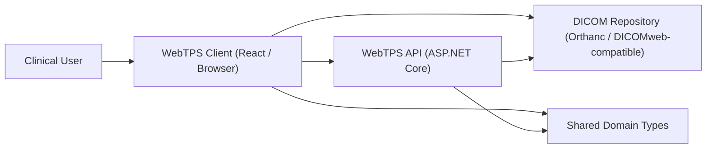
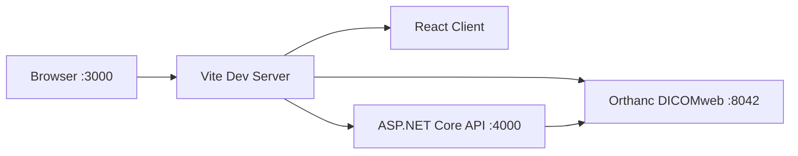

# System Architecture Specification Specification

---

**Document Metadata**

| Field | Value |
|-------|-------|
| **Document ID** | SYSARCH-SPEC |
| **Version** | 1.0 |
| **Generated** | 2026-05-16 |
| **Status** | Draft |
| **Project** | DHF Project |

---

## 1. Purpose

This document defines the software architecture baseline for DHF Project and identifies
the software items that constitute the system, in accordance with IEC 62304 §5.3.

It serves two roles:

1. Describe the current system decomposition and the requirements allocated to each software item
2. Constrain how the system is allowed to evolve — boundaries, responsibilities, and data flow

This is not a product roadmap document. Future-oriented statements must be interpreted through
the Product Strategy. This document may constrain how future work is implemented, but it must
not independently expand product scope ahead of that document.

---

## 2. Architectural Goals

The architecture must optimize for:

1. Repository-backed clinical workflow
2. Predictable contour review behavior
3. Explicit and testable boundaries
4. Minimal duplication of domain logic and data contracts
5. Incremental evolution without hidden coupling

---

## 3. System Context

DHF Project sits between clinical users and a DICOMweb-capable repository.

---

## 4. Software Items

The system is decomposed into the following software items per IEC 62304 §5.3:

### SYSARCH-001: Browser Client

**Status**: APPROVED

The primary software item running in the clinical user's browser. Responsible for
all user interaction, DICOM rendering, contouring workflow, and local state management.

Technology stack:
- React 18 + TypeScript (strict) + Vite — component framework and build tooling
- Cornerstone3D — GPU-accelerated DICOM rendering via WebGL (axial/sagittal/coronal MPR)
- Zustand + Immer — reactive state management (volumeStore, structureStore, uiStore)
- Tailwind CSS — dark clinical UI theme

Key sub-components:
- ViewportManager: manages Cornerstone3D rendering contexts and MPR layout
- MPRController: coordinates multi-planar reconstruction across viewports
- ContourEngine: freehand, polygon, brush, and eraser contouring tools; undo/redo
- DICOMweb client: QIDO-RS (query), WADO-RS (retrieve), STOW-RS (store) via /dicom-web proxy
- IndexedDB adapter: browser-local auto-save of in-progress structure set drafts

External interfaces:
- /dicom-web/* → Orthanc DICOMweb (proxied by Vite in dev, reverse proxy in prod)
- /api/* → ASP.NET Core API (proxied by Vite in dev)
- /ws → WebSocket for real-time updates (proxied)

Data flows:
- Image loading: QIDO-RS query → WADO-RS metadata → Cornerstone image IDs →
  VolumeBuilder → Cornerstone3D volume → ViewportManager.setVolume() → GPU render
- Contouring: user gesture → ContourEngine.addContour() → UndoRedoManager →
  structureStore → React re-render
- Draft persistence: structureStore dirty → IndexedDB auto-save → restore on reload
- Structure upload: active RTSTRUCT → STOW-RS to DICOM repository

**Allocated System Requirements**

- SYS-002
- SYS-003
- SYS-004
- SYS-005
- SYS-006
- SYS-007
- SYS-008
- SYS-009
- SYS-010
- SYS-011
- SYS-012
- SYS-014
- SYS-015

---
### SYSARCH-002: DICOMweb Repository Interface

**Status**: APPROVED

External DICOMweb-compatible storage system providing DICOM object persistence
and query capabilities. Accessed by the browser client directly via the /dicom-web
reverse proxy path.

Development environment: Orthanc (Docker, no authentication, port 8042)
Production environment: Hospital PACS or VNA with DICOMweb support

Exposed DICOMweb services:
- QIDO-RS: query studies, series, and instances by DICOM attributes
- WADO-RS: retrieve DICOM objects (bulk data, metadata, rendered frames)
- STOW-RS: store DICOM objects (CT series metadata, RTSTRUCT uploads)

Configuration:
- Dev: Vite proxies /dicom-web → http://localhost:8042 (no auth)
- Prod: reverse proxy to hospital PACS/VNA (auth configured per deployment)

The repository is the system of record for all patient imaging data and
finalized structure sets. It is not owned or operated by WebTPS.

**Allocated System Requirements**

- SYS-001
- SYS-006
- SYS-007
- SYS-011

---
### SYSARCH-003: ASP.NET Core API

**Status**: APPROVED

Thin HTTP gateway providing the server-side boundary of the WebTPS system.
Built with ASP.NET Core 10 (C#), running on port 4000.

Current responsibilities:
- Health endpoint (/api/health) for infrastructure smoke checks and CI validation
- Future: plan storage, user session management, compute orchestration

External interfaces:
- HTTP REST on port 4000 (proxied via Vite /api in dev)
- WebSocket on port 4000 (proxied via Vite /ws in dev)

The API intentionally does not process DICOM data directly in Phase 1. DICOM
operations are performed by the browser client via direct DICOMweb calls to the
repository. The API will take on a larger role in Phase C (Planning) when
server-side dose computation and optimization are introduced.

Build: dotnet build apps/api/api.csproj --configuration Release

**Allocated System Requirements**

- SYS-001
- SYS-006
- SYS-007
- SYS-013

---

## 5. Runtime Topology

### Local Development

Local startup: `pnpm repo:up` → `pnpm dev` + `pnpm api` → `pnpm local:doctor`

Architecture constraint: local setup must remain reproducible through documented scripts;
startup dependencies must stay simple enough to diagnose in one pass.

### CI Topology

CI verifies: frontend lint · typecheck · test · build — API build — shared-types typecheck
and build — local smoke validation via `pnpm local:doctor`.

Architecture constraint: new architectural layers should not be introduced unless they can
be validated in CI or have a deliberate plan to become CI-verifiable.

---

## 6. Data Flow

### Image Loading

1. User selects patient / image context
2. Client queries DICOMweb repository via QIDO-RS
3. Client retrieves series metadata and bulk data via WADO-RS
4. Client builds browser-side renderable volume (VolumeBuilder → Cornerstone3D)
5. Viewports render axial / sagittal / coronal views

Constraint: image loading must remain repository-first; browser memory may cache loaded
image state temporarily, but cache semantics must stay invisible to end users.

### Structure Flow

1. User activates a structure set associated with an image set
2. Client imports RTSTRUCT into browser editing state
3. Browser maintains transient draft state for editing, undo/redo, and review
4. Push/export produces a new RTSTRUCT payload stored via STOW-RS

Constraint: repository-backed RTSTRUCT is the durable source of truth; browser-local draft
state is transient and must never be confused with durable repository state.

---

## 7. State Ownership

### Repository-owned

- Image series
- Finalized RTSTRUCT instances
- Future RTDOSE and planning objects

### Browser-owned (transient)

- Active workspace selection and loaded viewport state
- Tool mode and window/level settings
- Local contour draft changes before push
- Measurement annotations

### Shared-contract-owned

- TypeScript interfaces in `packages/shared-types` representing cross-workspace business objects

Constraint: if ownership is ambiguous, prefer explicit documentation or an ADR before adding
another persistence path.

---

## 8. Evolution Rules

1. **Repository-first remains primary** — direct local file support may exist for debugging,
   but must not redefine the main product interaction model.

2. **API stays thin until justified** — move logic from client to API only when there is a
   clear need for security, orchestration, environment isolation, or long-running execution.

3. **New compute services require a documented boundary** — any future dose engine, AI contour
   service, or worker tier must be introduced through an ADR and CI/testability plan, and only
   when that capability is in scope per product strategy.

4. **Shared types remain authoritative** — new modules must not fork patient / image /
   structure / plan contracts.

5. **Architecture becomes more explicit, not more magical** — hidden event buses, implicit
   caches, or opaque orchestration layers are not acceptable substitutes for clear boundaries.

6. **Architecture does not authorize scope expansion** — if a capability is not supported by
   current product strategy, this document should not be used to justify implementing it early.

---

## 9. Non-Functional Constraints

Must support:
- Deterministic local bootstrap
- Reproducible CI validation
- Actionable logs for startup and integration failures
- Incremental deployment hardening without redesigning the core workflow

Must avoid:
- Hidden machine-local coupling
- Environment-specific behavior embedded in product logic
- Repository lock-in that breaks DICOMweb portability
- Untestable infrastructure additions

---

## 10. Open Architectural Decisions

These areas remain open and must be resolved through ADRs before major implementation work:

- Production deployment topology
- RTDOSE ingestion path
- Future compute-service boundary for AI or dose operations
- Formal persistence strategy for browser draft recovery

These are architecture placeholders only; implementation timing is governed by product strategy.

---

## 11. Requirements Traceability

The following system requirements are addressed by the software items above:

| Requirement | Addressed by |
|-------------|--------------|
| SYS-001 | SYSARCH-002 SYSARCH-003  |
| SYS-002 | SYSARCH-001  |
| SYS-003 | SYSARCH-001  |
| SYS-004 | SYSARCH-001  |
| SYS-005 | SYSARCH-001  |
| SYS-006 | SYSARCH-001 SYSARCH-002 SYSARCH-003  |
| SYS-007 | SYSARCH-001 SYSARCH-002 SYSARCH-003  |
| SYS-008 | SYSARCH-001  |
| SYS-009 | SYSARCH-001  |
| SYS-010 | SYSARCH-001  |
| SYS-011 | SYSARCH-001 SYSARCH-002  |
| SYS-012 | SYSARCH-001  |
| SYS-013 | SYSARCH-003  |
| SYS-014 | SYSARCH-001  |
| SYS-015 | SYSARCH-001  |

---

## 12. Summary

| Metric | Count |
|--------|-------|
| **Software Items** | 3 |
| **System Requirements Covered** | 15 |

---

## 13. Document Control

**Standard**: IEC 62304:2006+AMD1:2015 §5.3
**Last Updated**: 2026-05-16

Architecture changes that modify major system boundaries, runtime topology, state ownership
rules, or primary data flows must be reflected here. Concrete architectural decisions must
also be captured in an ADR.

---

*Generated from DHF items in DHF Project.*