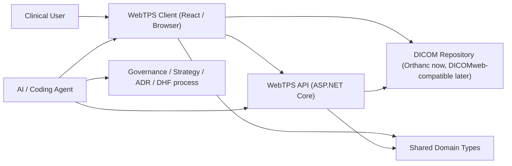
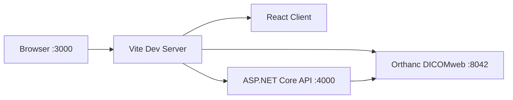

# System Architecture

## Purpose

This document defines the architecture baseline for WebTPS.

It serves two roles:

1. describe the current system shape that exists today
2. constrain how the system is allowed to evolve

This is not a product roadmap document. It is the architecture source of truth
for system boundaries, responsibilities, data flow, runtime topology, and
allowed future implementation direction.

Future-oriented statements in this document must be interpreted through
[Product strategy](../strategy/product_strategy.md) and
[Product roadmap](../strategy/product_roadmap.md). This document may constrain
how future work is implemented, but it must not independently expand product
scope ahead of those documents.

Related documents:

- [Product strategy](../strategy/product_strategy.md)
- [Product roadmap](../strategy/product_roadmap.md)
- [Technical strategy](../strategy/technical_strategy.md)
- [Testing strategy](../strategy/testing_strategy.md)
- [ADR template](../adr/ADR-template.md)

## Scope

This architecture covers:

- browser client
- API boundary
- DICOM repository integration
- shared domain contract
- local and CI runtime topology

This architecture does not yet define:

- full treatment planning engine architecture
- dose calculation engine internals
- multi-user collaboration protocol
- production cloud deployment topology

Those must be added later through ADRs and follow-on architecture updates.

## Architectural Goals

The architecture must optimize for:

1. repository-backed clinical workflow
2. predictable contour review behavior
3. explicit and testable boundaries
4. minimal duplication of domain logic and data contracts
5. incremental evolution without hidden coupling

## System Context

WebTPS sits between clinical users and a DICOMweb-capable repository.

## Container View

### 1. Browser Client

Location: `apps/client`

Responsibilities:

- clinical workspace UI
- viewport rendering and image interaction
- browser-side workflow state
- RTSTRUCT import, draft editing, QA, compare, and export preparation
- direct DICOMweb read access in local development and repository-backed flows

Allowed future evolution:

- may gain additional review and planning UI modules only when such work is
  consistent with the active product strategy and current roadmap phase
- may keep client-owned interaction logic and local transient draft state
- may call backend services for heavier compute or orchestration

Not allowed:

- becoming a second source of truth for repository-owned image / RT objects
- embedding developer-machine-specific paths or environment assumptions
- duplicating canonical shared domain types

### 2. API Boundary

Location: `apps/api`

Responsibilities today:

- health and debug endpoints
- HTTP integration boundary for future server-side orchestration

Responsibilities in future:

- secure orchestration when roadmap phase and product scope require it
- server-owned integration logic when product direction and technical strategy
  justify moving behavior out of the browser
- long-running operations that do not belong in the browser
- environment-aware services that should not live in the client

Not allowed:

- absorbing client-owned UI workflow logic without clear justification
- defining independent domain contracts that drift from `packages/shared-types`

### 3. Shared Domain Contract

Location: `packages/shared-types`

Responsibilities:

- canonical cross-workspace data model
- stable contract for patient, study, image, structure, and future planning data

Constraints:

- all cross-workspace model changes start here
- consumers adapt after the shared contract changes
- app-local copies of the same domain model are not allowed

### 4. DICOM Repository

Current development implementation:

- Orthanc via Docker

Architectural role:

- system of record for images and repository-backed RT objects
- primary integration boundary for image and RTSTRUCT access

Future requirement:

- WebTPS must remain compatible with standards-based DICOMweb repositories
- Orthanc is the local development implementation, not a product-level lock-in
- repository integration expansion must follow product strategy and roadmap
  priorities rather than ad hoc source-specific feature work

Not allowed:

- designing primary workflows around direct local file import instead of
  repository-backed access
- assuming repository-specific behavior without isolating it behind clear
  integration logic

## Runtime Topology

### Local Development Topology

Current local startup path:

- `pnpm local:setup`
- `pnpm local:up`
- `pnpm local:doctor`

Architecture constraint:

- local setup must remain reproducible through documented scripts
- startup dependencies must stay simple enough to diagnose in one pass

### CI Topology

CI currently verifies:

- frontend lint, typecheck, test, build
- API build
- shared-types typecheck and build
- local smoke validation through `pnpm local:doctor`

Architecture constraint:

- new architectural layers should not be introduced unless they can be
  validated in CI or have a deliberate plan to become CI-verifiable

## Data Flow

### Image Flow

1. user selects patient / image context
2. client queries repository-backed metadata
3. client loads image series through DICOMweb-compatible access
4. client builds browser-side renderable volume state
5. viewports render axial / sagittal / coronal review views

Constraint:

- image loading should remain repository-first
- browser memory may cache loaded image state temporarily, but cache semantics
  must stay invisible to end users

### Structure Flow

1. user activates a structure set associated with an image set
2. client imports RTSTRUCT into browser editing state
3. browser maintains transient draft state for editing, undo/redo, QA, and
   review operations
4. push/export produces a new RTSTRUCT payload for repository publication

Constraint:

- repository-backed RTSTRUCT remains the durable source of truth
- browser-local draft state is allowed for responsiveness, but it is transient
- local draft state must never be confused with durable repository state

### Validation / Governance Flow

1. request is pre-analyzed against strategy and architecture constraints
2. implementation proceeds in the owning workspace
3. validation commands are run and named explicitly
4. DHF impact is either updated or explicitly ruled out
5. functional changes go through branch + PR + review follow-up

Constraint:

- architecture changes, dependency model changes, and deployment-shape changes
  must be captured through ADRs

## State Ownership Rules

### Repository-owned state

- image series
- repository-backed RTSTRUCT instances
- future RTDOSE and planning objects

### Browser-owned transient state

- active workspace selection
- loaded viewport state
- tool mode
- local contour draft changes before push
- QA display state
- measurement annotations

### Shared-contract-owned state

- TypeScript interfaces representing cross-workspace business objects

Constraint:

- if ownership is ambiguous, prefer explicit documentation or an ADR before
  adding another persistence path

## Evolution Rules

Future implementation must follow these rules:

1. Repository-first remains the primary workflow
   Direct local file support may exist for debugging or import tooling, but it
   must not redefine the main product interaction model.

2. The API stays thin until server-side logic is justified
   Move logic from client to API only when there is a clear need for security,
   orchestration, environment isolation, or long-running execution.

3. New compute services require a documented boundary
   Any future Python service, dose engine, AI contour service, or worker tier
   must be introduced through an ADR and a CI/testability plan, and only when
   that capability is in scope according to product strategy and roadmap phase.

4. Shared types remain authoritative
   New modules must not fork patient / image / structure / plan contracts.

5. Architecture should become more explicit, not more magical
   Hidden event buses, implicit caches, or opaque orchestration layers are not
   acceptable substitutes for clear boundaries.

6. Architecture does not authorize scope expansion
   If a future capability is not supported by current product strategy and
   roadmap phase, this document should not be used to justify implementing it
   early.

## Non-Functional Constraints

The architecture must support:

- deterministic local bootstrap
- reproducible CI validation
- actionable logs for startup and integration failures
- manageable operational diagnostics
- incremental deployment hardening without redesigning the core workflow

The architecture must avoid:

- hidden machine-local coupling
- environment-specific behavior embedded in product logic
- repository lock-in that breaks DICOMweb portability
- untestable infra additions

## Open Architectural Decisions

These areas remain open and should be resolved through ADRs before major
implementation work:

- production deployment topology
- preview environment architecture
- RTDOSE ingestion path
- future compute-service boundary for AI or dose operations
- formal persistence strategy for browser draft recovery beyond current local
  behavior

These are open only as architecture placeholders. They do not imply immediate
delivery priority; implementation timing is governed by product strategy and
roadmap.

## Architecture Change Policy

Update this document when a change modifies:

- major system boundaries
- runtime topology
- state ownership rules
- primary data flows
- integration responsibilities

Use an ADR when the change is a concrete architectural decision. Update this
document when that decision changes the architecture baseline that future work
should assume.
